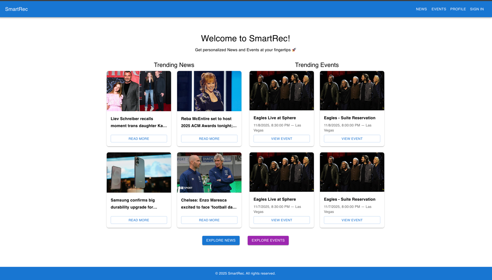
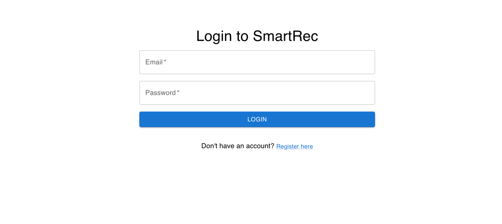
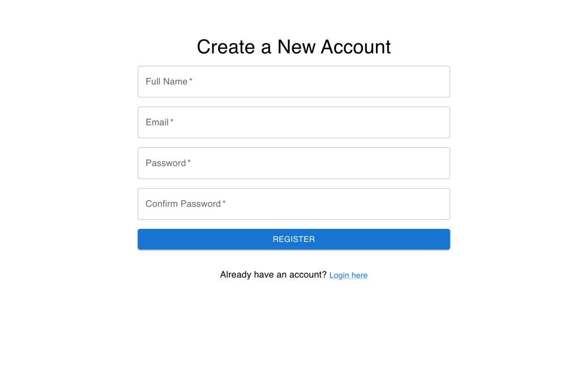
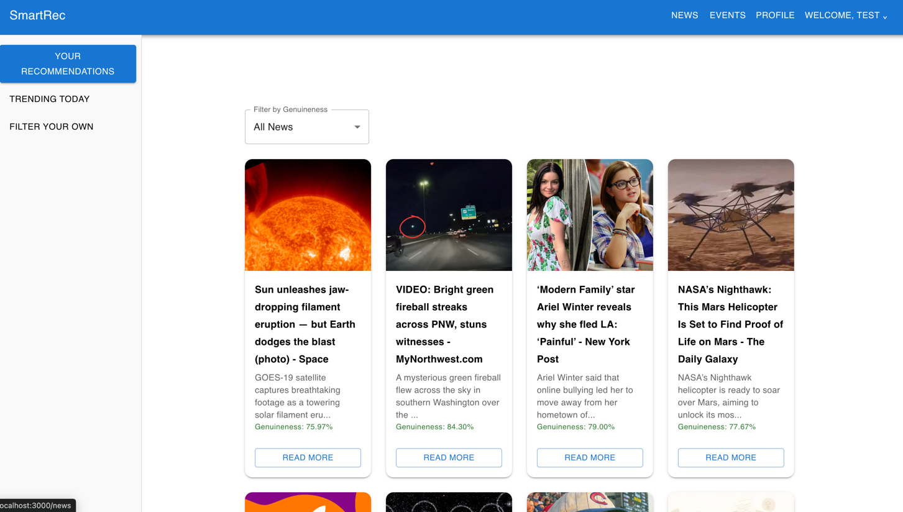
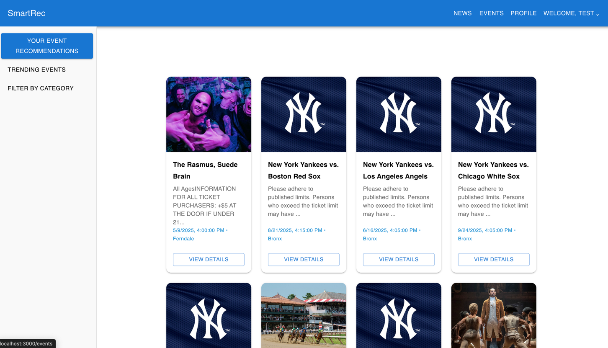
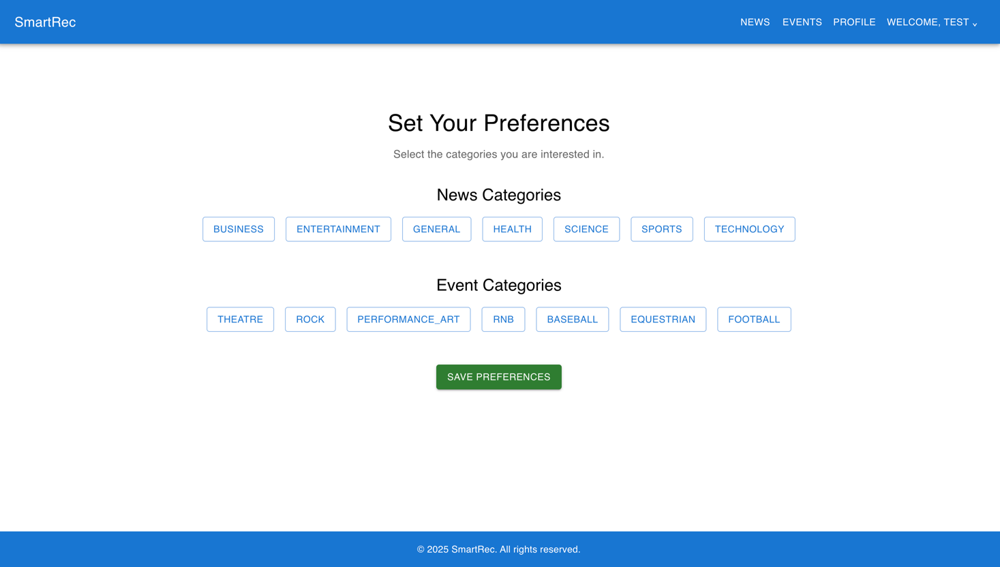

# 🧠 SmartRec – Personalized News & Event Recommendation System

## 📑 Table of Contents
- [📘 Project Overview](#-project-overview)
- [🌟 Key Features](#-key-features)
- [📚 Documentation](#-documentation)
- [🎥 Demo](#-demo)
- [🖼 UI Screenshots](#-ui-screenshots)
- [⚙️ Local Development Setup](#️-local-development-setup)
- [👥 Contributors](#-contributors)


## 📘 Project Overview

**SmartRec** is a modular and secure recommendation platform designed to deliver personalized news and event content. Unlike traditional systems that operate within a single domain or struggle with credibility and geographic awareness, SmartRec offers a unified solution that fuses both content categories using cutting-edge machine learning techniques.

Built using React (frontend), Django (backend), and PostgreSQL (data layer), SmartRec combines **Sentence-BERT semantic embeddings**, **co-click collaborative filtering**, and **XGBoost-based re-ranking** to offer real-time, relevant, and trustworthy content suggestions. The system incorporates **genuineness scoring** for news, **location-based filtering** for events, and secure, token-authenticated APIs for privacy and integrity.

SmartRec addresses major challenges in recommender systems:

* The cold-start problem via onboarding and trending fallback
* Overspecialization by hybrid scoring and re-ranking
* Content trustworthiness via a credibility filter
* Siloed user experiences by combining news and event feeds
* Scalability through modular ML pipelines and caching
* Real-time responsiveness using FAISS and async task queues

It is built for extensibility, allowing future integration of explainable AI, advanced user profiling, and expansion into additional content domains.

---

## 🌟 Key Features

### 🔍 Personalized Recommendations

* **News**: Sentence-BERT embeddings + co-click collaborative filtering + XGBoost re-ranking
* **Events**: Hybrid semantic and latent factor model for dynamic filtering by genre, city, and date

### 🔁 Real-Time Adaptation

* User interactions (clicks, likes) trigger profile updates
* FAISS and NumPy vectorization ensure sub-second retrieval latency

### 🔐 Security & Privacy

* JWT-secured endpoints
* Custom Django middleware
* Password hashing, HTTPS communication, and role-based access

### ✅ Credibility & Trust

* Genuineness scoring model flags news with low credibility
* Users can filter content based on trust thresholds

### 🌍 Location-Based Filtering

* Manual user location input enhances event relevance
* Integration with Ticketmaster API for local event discovery

### 🚀 Scalable Architecture

* Modular design with clear separation of client, app, and data layers
* Ready for Docker, Kubernetes, and cloud deployment
* CI/CD and monitoring-ready with logging and observability

### 🧠 NLP & ML-Driven

* Sentence-BERT for semantic understanding
* XGBoost and Ridge Regression for ranking and scoring
* Multi-model architecture for cold-start mitigation

### 💬 Responsive UI

* Built with React and Material-UI
* Context-based state and notification management
* Multiple tabs: Personalized feed, Trending, AI Recommendations

## 📚 Documentation

- [📡 API Reference](./docs/API.md)
- [🧪 API Testing Guide](./docs/API_Testing.md)
- [⚛️ Frontend Architecture](./docs/Frontend.md)

## 🎥 Demo

Watch the SmartRec walkthrough video:

👉 [Click here to watch the demo](https://youtu.be/AbiBKP5Uu9U)

## 🖼 UI Screenshots

### 🏠 Home Page


### 🔐 Login Page


### 📝 Register Page


### 📰 Personalized News Feed


### 🎟 Event Recommendations


### 📊 Preference Selection



## ⚙️ Local Development Setup

### 📥 Clone the Repository

```bash
git clone https://github.com/chandumummadi/SmartRec.git
cd SmartRec
```

---

### 🐍 Backend Setup (Django)

```bash
# Navigate to backend folder
cd Smartrec-Backend

# Create virtual environment
python -m venv venv
source venv/bin/activate  # On Windows: venv\Scripts\activate

# Install dependencies
pip install -r requirements.txt

# Run the Django server
python manage.py runserver
```

---

### ⚛️ Frontend Setup (React)

```bash
# Navigate to frontend directory
cd ../Smartrec_frontend/smartrec-frontend

# Install dependencies
npm install

# Start the React app
npm start
```

By default:

* Backend runs at: [http://localhost:8000](http://localhost:8000)
* Frontend runs at: [http://localhost:3000](http://localhost:3000)


## 👥 Contributors

SmartRec was designed and developed by:

* **Sharath Chandra Mummadi**
* **Sai Charan Reddy Boyapalle**
* **Rohit Dadlani**
* **Piyush Gade**


